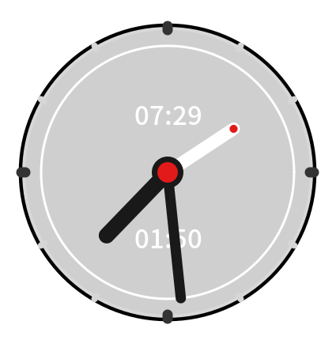

# gnome-shell-cairo

---

Cairo Clock for gnome-shell

Import from `cairo-timer`

Click the clock face to set the alarm, click the center circle to enable the alarm.

Special thanks `Simon Schneegans`
